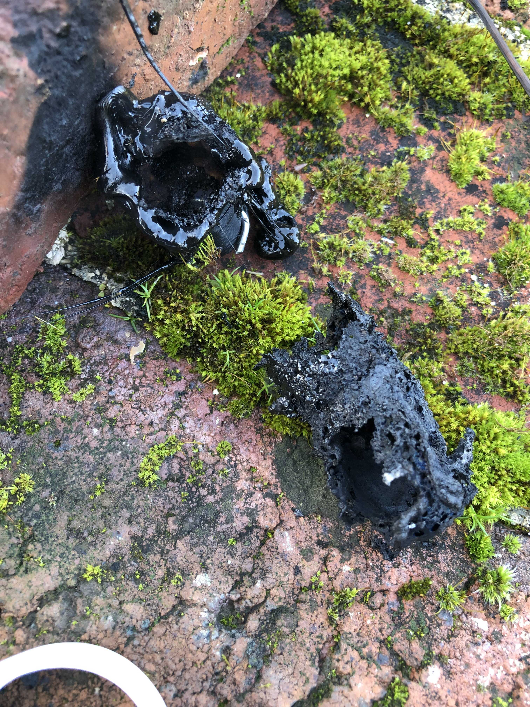
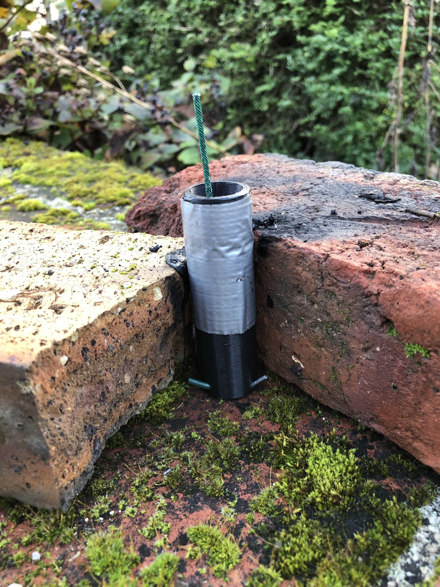

# Welcome to ladybug website 

##  Les fichiers sont disponible ici https://github.com/gazpascho/ladybug
Ladybug project
Une grande partie de mon travail est inspirée de la chaîne youtube “french rocket boy”, dont voici le lien : https://www.youtube.com/@frenchrocketboy3526

## I Introduction 
Ladybug est le nom de mon projet, consistant à créer, désigner, tester et lancer des fusées artisanales, faites maison de a à z. Les fusées sont d’abord imaginer puis dessinées sur papier format A3 avec différent vue (de côté, de face et du dessus), en prenant en compte les largeurs des différentes pièces. Après ça je design les pièces sur un logiciel 3D (Matter-Control). Je les imprimes, puis les assembles

## II Modèles 

Il y a pleins de modèles de fusées que je voudrais faire. Malheureusement cela reste à l’etat d’idée et aucune conception ni réalisation à été faite. 
# Endurance
Hauteur : 40cm
Largeur : 5,25cm (à vérifier)
Endurance devrait être ma première “ vrai” fusée. Elle devrait voler une première fois “à vide” soit sans parachute, pour tester la resistance des materiaux ainsi que la design de phenix. Dès que celui si sera valider, un système electronique devra être inserrer dans la fusée puis un second vole devrait avoir lieu avec deploiment du parachute. Voici les étapes de chaque fusées : 
-dessein sur papier ✅

-design 🧠

-test du moteur (voire la parti dédier a phenix) ⏱

-static fire ⏱

-launch ⏱
Lorsque j’écris “Static fire” je parle d’une repetition générale,a avec allumage du moteur, mais sans decollage. La fusée sera à l’horizontale et subira la poussée du moteur.

# Maverick
Maverick est un projet de fusée à boosters latéraux. Elle aura la même forme que la falcon heavy de space X. Les 3 moteurs phenix s’alumeront en même temps puis les 2 boosters lateraux se separont pour permettre au main stage d’aller le plus haut possible. Avec cela, les 2 boosters externes déploireront leurs prachutes pour “atterir” doucement par terre. si la poussée est asseé puissante, je pourrai y installer ma camera pour filmer. 

# bundle
Bundle est comme une fusée leptus, sauf qu’elle devrait posséder 2 étages s’allumant chacun leur tour, comme les fusées actueles.

# Bundle evolution
Bundle evolution s’appuie sur le même principe que Bundle. Un premier étage enmène la fusée a une certaine altitude, puis se sépare de cette dernière. Le deuxième aura la forme du concorde et pourra être dirigé à distance par un humain au sol. Le premier etage retombera doucement grâce à un parachute quant au 2 eme etage volera et atterira sur le sol

## III Daily map

**18 aout 2022**
Après avoire fait du rocket candy, j’ai commencer à faire des essais qui ont été concluents. Le rocket candy brule bien et les proporstions sont stables, à ne pas changer

**19 aout**
Après avoir fait 40 grm de rc, je l’ai introduit dans une petite fusée. Qqs dificultés a l’allumage ont été rencontré. La fusée a finalement décolé. Comme le rc n’a pas été introduit de manière homogène, la fusée a fait le hs (hand spiner) puis a explos é car il y avait pas de bouchons… (images)

**28 aout 2022**
Debut du design de endurance. Plan déjà fait, dans le carquois

**2 septembre**
2022 design terminé. Debut d’impression de plusieurs pièces dont coiffe, bouchon 2 et phenix/endurance. Echec de l’impression, refaire le haut.

**9 septembre**
J’ai essayé pendant 1h d’imprimer les corstage et les grid fins ensemble pour plus de resisctance mais mon ordi n’est pas assez puissantJe vais donc imprimer tout separement 

**26 septembre**
Dû à l’arrivée en terminale, j’ai été débordé de travail J’ai néanmoins pu reimprimer le phenix/endurance (qui est tres propre d’ailleurs) ainsi que les grids fins el le corestage

**10 octobre**
design du moule pour phenix/endurance redisgn du nose conne et impression presque fini de endurance. Impression du moule pour phenix/endurance

**14 octobre**
Début du transfert de documentation.txt vers google docs pour pouvoir l’utiliser sur n’importe quel plateforme et pour pouvoirle completer si des idées me viennent.
Remplissage phenix de rocket candy et pb rencontrés pour mettre bouchon

**15 octobre**
Assemblage d’Endurance avec de la colle forte pour pvc (initialement utilisé pour les tuyeaux de pvc). Assemblage du nose cone avec le corestage du haut et fixation des grids fins avec le corestage.

**30 octobre au 5 novembre 2022**
Je vais dans la maison de mes grands parents. Je pourrai donc faire plusieurs
J’ai prévu de faire 2 essais de combustion avec phenix/endurance et phenix/leptus 
A faire avant de partir 
imprimer 2 phenix/endurance
prendre le rocket candy
imprimer bouchon/phenix/leptus
prendre le colle forte

**31 octobre 2022**
Après avoir rempli phenix/endurance d’environ 30gr de rc je l’ai allumé (voire vidéo)
la tuyère a été éjectée sous la pression mais le rc a produit en pousée pendant 7 secondes environ.
J’ai donc repris un moteur phenix/endurance que j’ai légèrement modifié (sur le rocket candy j’ai mis de la colle de pistolet à colle puis j’ai mis 2 fils de fer en percant le moteur à l’extrémité)

**1 novembre 2022**
J’ai légèrement modifié un phenix/endurance de facon à augmenter la taille du trou de la tuyère pour éviter une ejection comme cela à eu lieu lors du premier essai
J’ai également découvert une nouvelle architecture possible de moteur, dont le principe réside sur le placement de la tuyère (au centre et non sur les cotés, permetant une ejection des gazs très fine et très précise).

**31 decembre 2022**
Après une grande pause du en partie à l”école, je suis continue enfin ce projet
Après 2 tests à la campagne de moteur phenix/endurance, j’ai appris 2, 3 trucs.
Une bonne chose, le bouchon formé à partir de colle à pistolet à colle marche et permet de maintenir les gazs
Cependant, la tuyère en plastique fond lors de l’allumage laissant un gros trou dans le moteur, qui devient un simple cylindre bouché en haut.
J’ai peut etre une idée pour patcher ce problème. faire une “sur-tuyère” qui protège la tuyère. Elle serait faite en metal

**27 janvier 2023**
Comme faire une fusée entièrement en 3D, je suis résout a devoire utiliser du metal. En effet, sur les essais, on remarque bien que la tuyère se consumme et fond sous la chaleur et l'intensité des gazs exprimés. L'idéal serait d'avoir une surtuyère, comme présenté précedement, de facon a éviter qu la tuyère fonde. Applelons cette pièce le shield. Idéalement, elle devrait épouser la forme de la tuyère. Phenix serait alors imprimer en 2 parties, coupées dans le verticale. Comme cela il ne reste qu'a coller les 2 parties de phenix autour du shield.
Il faudrait donc la faire à l'aide d'une friaseuse, mais je pense que je vais devoir la faire en bois car je n'ai pas de friaseuse à la maison...

**02/03/2023 **
Le design de la surtuyère est terminé. J’ai réussi à trouver un site qui permet l’impression de pièce en metal par extrusion (cad que une pièce est métal est usinée pour former la pièce demander). Je preferai ce type de frabrication, ayant peur qu’en demandant une impression en 3D, la pièce puisse se sincer en 2 parties plus facilement. 
Idéalement, le moteur phenix serait imprimer en 2 parties, découpé dans le sens de la longueur. Puis je collerai les 2 parties autour de la surtuyère, m’assurant ainsi sa solidification, au moteur. Après un vol, je couperai le moteur en 2 de facon à récuperer la surtuyère. 

## IV moteurs

Pour les moteurs de manière générale, il faut, avant un lancement
Faire 1 voire 2 test de combustion simple pour voire comment se comporte le moteur et avoir un rapide apercu de son comportement lors de la combustion
Puis faire un test sur un band d’essai en mettre une balance dessus pour messurer la poussée au cour du temps.
Faire ensuite un graphique sur excel et importer le graphique créé sur open rocket
Il faudra modifier le design de phenix, et installer une sur tuyère de facon à ce qu’elle evite de fondre lors des allumages…

Pour le bouchon (inspirée de french rocket boy):
-sur le rocket candy, mettre un bouchon en bois 
-par dessus, mettre du de la colle (pistolet à colle) jusqu’au bout *
-Percé le moteur en largeur et en longeur puis inserrer des fils de fer de facon à retenir le bouchon lors de la combustion
cette technique marche très bien, à continué pour les moteurs suivants

Après des tests le 28 décembre dans la maison de campagne de mes grands parents, je me suis rendu compte que le moteur fondait du à l’ejection des gazs et à la chaleur (voire photo)
Après plusieurs reflexions, j’ai peut etre trouver une solution tout en gardant la philosophie d’avoir un moteur en 3D. Il faudrait rajouter une “sur” tuyère. Une plaque de metal de 2 mm devrait etre poser de manière à epouser la forme de la tuyère de facon à la proteger durant le lancement. (photo)
Maintenant, plusieurs possibilités s’offre à moi. Soit de la faire moi en bois, ou bien de la commander ou de la faire faire par une 
En la faisant en bois, j’ai peur qu’elles soient imparfaite. J’ai donc terminé le design et ai trouvé un site premettant de faire des pièces par usinage. 

## V Road map 

Voici les etapes à faire pour continuer ce projet :
s’occuper de la surtyère 
Designer la surtyère
Appeler le mec de chez protolabs
recevoir la pièce puis l’implanter 

**Des photos du moteur phenix (echec)**

